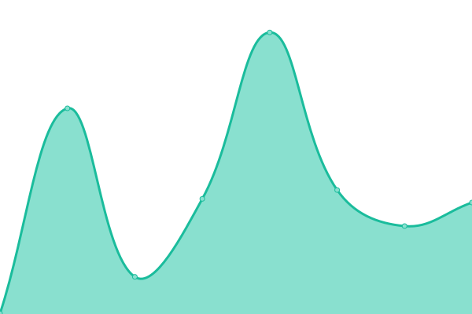

# [📈 Live Status](https://fnzv.github.io/status): <!--live status--> **🟧 Partial outage**

This repository contains the open-source uptime monitor and status page for [Sami](sa.mi.it), powered by [Upptime](https://github.com/upptime/upptime).

With [Upptime](https://upptime.js.org), you can get your own unlimited and free uptime monitor and status page, powered entirely by a GitHub repository. We use [Issues](https://github.com/fnzv/status/issues) as incident reports, [Actions](https://github.com/fnzv/status/actions) as uptime monitors, and [Pages](https://fnzv.github.io/status) for the status page.

<!--start: status pages-->
<!-- This summary is generated by Upptime (https://github.com/upptime/upptime) -->
<!-- Do not edit this manually, your changes will be overwritten -->
<!-- prettier-ignore -->
| URL | Status | History | Response Time | Uptime |
| --- | ------ | ------- | ------------- | ------ |
|  [sa.mi.it](https://sa.mi.it) | 🟥 Down | [sa-mi-it.yml](https://github.com/fnzv/status/commits/HEAD/history/sa-mi-it.yml) | 

 169ms
     
 | 

<a href="https://monitor.sa.mi.it/history/sa-mi-it">0.00%</a>
    

|  [sami.pw](https://sami.pw) | 🟥 Down | [sami-pw.yml](https://github.com/fnzv/status/commits/HEAD/history/sami-pw.yml) | 

 188ms
     
 | 

<a href="https://monitor.sa.mi.it/history/sami-pw">100.00%</a>
    

|  [Telegram](https://web.telegram.org) | 🟩 Up | [telegram.yml](https://github.com/fnzv/status/commits/HEAD/history/telegram.yml) | 

 415ms
     
 | 

<a href="https://monitor.sa.mi.it/history/telegram">100.00%</a>
    

|  [Whatsapp](https://web.whatsapp.com) | 🟩 Up | [whatsapp.yml](https://github.com/fnzv/status/commits/HEAD/history/whatsapp.yml) | 

 250ms
     
 | 

<a href="https://monitor.sa.mi.it/history/whatsapp">100.00%</a>
    

|  [YT](https://web.whatsapp.com) | 🟩 Up | [yt.yml](https://github.com/fnzv/status/commits/HEAD/history/yt.yml) | 

 66ms
     
 | 

<a href="https://monitor.sa.mi.it/history/yt">100.00%</a>
    

|  [Twitter](https://twitter.com) | 🟩 Up | [twitter.yml](https://github.com/fnzv/status/commits/HEAD/history/twitter.yml) | 

 218ms
     
 | 

<a href="https://monitor.sa.mi.it/history/twitter">100.00%</a>
    

|  [AWS Console](https://console.aws.amazon.com) | 🟩 Up | [aws-console.yml](https://github.com/fnzv/status/commits/HEAD/history/aws-console.yml) | 

 335ms
     
 | 

<a href="https://monitor.sa.mi.it/history/aws-console">100.00%</a>
    

|  [Contaboo](https://contabo.com) | 🟥 Down | [contaboo.yml](https://github.com/fnzv/status/commits/HEAD/history/contaboo.yml) | 

 3605ms
     
 | 

<a href="https://monitor.sa.mi.it/history/contaboo">3.31%</a>
    

<!--end: status pages-->

[**Visit our status website →**](https://fnzv.github.io/status)

## 📄 License

- Powered by: [Upptime](https://github.com/upptime/upptime)
- Code: [MIT](./LICENSE) © [Sami](sa.mi.it)
- Data in the `./history` directory: [Open Database License](https://opendatacommons.org/licenses/odbl/1-0/)
